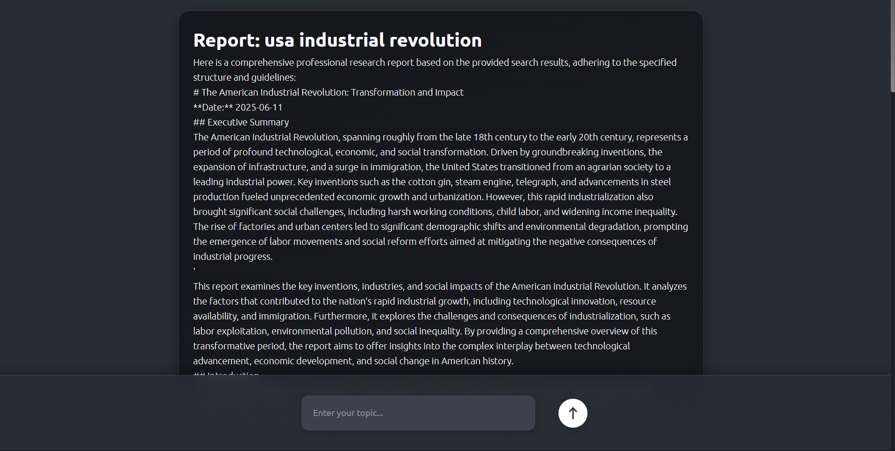
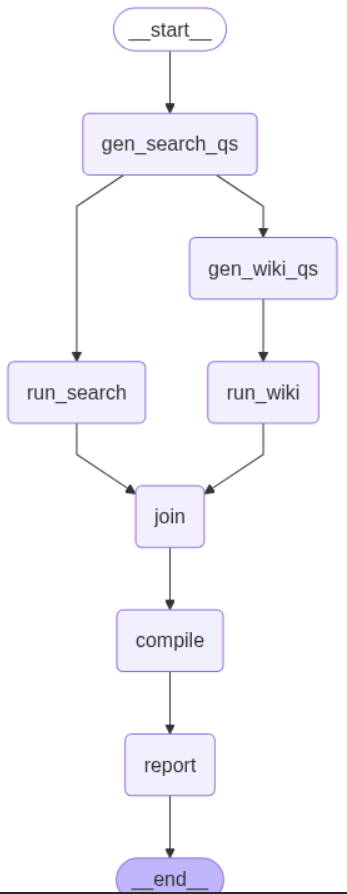

# 🤖 AI Research Agent with LangGraph + LangChain

An intelligent AI-powered research agent that generates topic-based comprehensive reports using LangGraph and LangChain. Built for real-world research automation with modern DevOps practices — deployed on **GKE** with **Terraform**, **GitHub Actions**, **NGINX Ingress**, and monitored using **LangSmith**.

---

## 📂 Folder Structure

```
📁 root/
📌 frontend/            # React app
📌 assets/            # Preview images
📌 .github/             # Github-actions workflows
📌 backend/             # FastAPI WebSocket backend
📌 terraform/           # Terraform IaC files
📌 k8s/                 # K8s YAMLs (microservices, ingress, config)
```

---

## 📸 Frontend Preview:


---

## 🧠 What It Does

This research agent uses:

* 🔁 **LangGraph** to manage stateful workflows and fallback logic
* 🧱 **LangChain** tools to generate queries and compile research
* 🧪 **LangSmith** for tracing, debugging, and monitoring
* 🧠 **Gemini API** for LLM interactions
* 🌐 **DuckDuckGo + Wikipedia APIs** with a custom fallback to Bing search tool

### 🛠️ Workflow Overview

1. **Generate 20 search queries** and **5 Wikipedia queries** based on a topic.
2. **Run DuckDuckGo + Wikipedia search** with fallback mechanisms.
3. **Compile all results** using the Gemini API.
4. **Generate a final research report**.

---

## 🖼️ LangGraph Flow Diagram



---

## 🚀 Deployment Stack

* ⚛️ **React** (frontend) with WebSocket support
* ⚡ **FastAPI** backend with `/ws/research` endpoint
* ☁️ **GKE** (Google Kubernetes Engine)
* 🔒 **NGINX Ingress** to route frontend/backend
* 🔧 **Terraform** for full Infrastructure as Code
* 🧪 **LangSmith** for monitoring agent flows
* 🔄 **GitHub Actions** for CI/CD pipeline

---

## ⚙️ DevOps Highlights

| Feature            | Tool/Tech Used           |
| ------------------ | ------------------------ |
| CI/CD              | GitHub Actions           |
| IaC                | Terraform                |
| Containerization   | Docker + K8s             |
| Ingress Controller | NGINX                    |
| Hosting            | Google Kubernetes Engine |
| Monitoring         | LangSmith                |

---

## 📦 Environment Variables

Set these in `.env` files (not committed):

```env
# Backend
GOOGLE_API_KEY=your_key_here
LANGSMITH_TRACING=true
LANGSMITH_OTEL_ENABLED=true
LANGSMITH_API_KEY=your_key_here

```

Also define them in K8s ConfigMaps and Secrets for production.

---

## 🧪 Testing Locally

```bash
# Backend (FastAPI)
cd backend
uvicorn app:app --reload

# Frontend (React)
cd frontend
npm install && npm run dev
```

---

## 📜 License

MIT — go build, break, and remix it however you want.

---

## 🙌 Credits

* LangChain, LangGraph, LangSmith
* Google Cloud GKE
* Gemini (Google AI)
* DuckDuckGo & Wikipedia APIs
* Your sweat, code, and curiosity 💪
